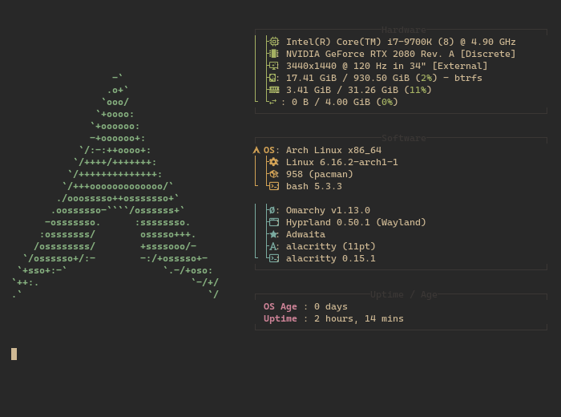

# Hi, I'm Jaime

<picture>
  <source media="(prefers-color-scheme: dark)" srcset="./assets/arch-dark.png">
  <source media="(prefers-color-scheme: light)" srcset="./assets/arch-light.png">
  
</picture>

I'm a software engineer and recovering full-stack developer primarily interested in building fun things with Go. Also currently developing a healthy, balanced relationship with Claude and Arch Linux (btw).

My personal GitHub is primarily for conducting research and capturing different ideas for later reference. All of my production work lives in private, inaccessible repositories and are not public facing.
